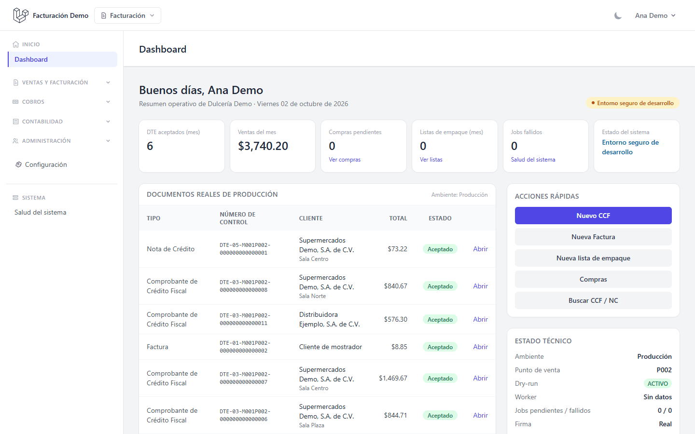
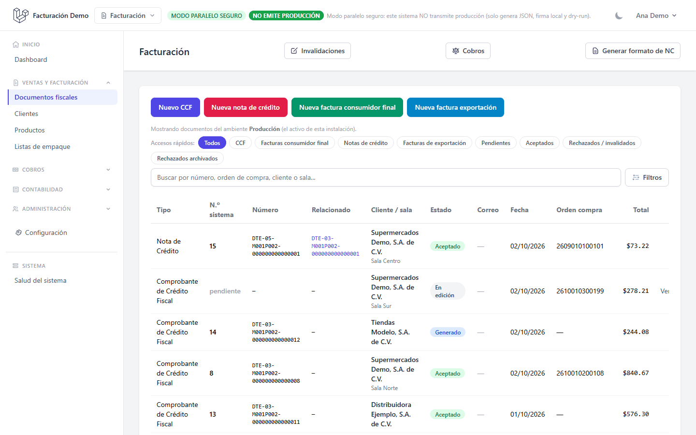
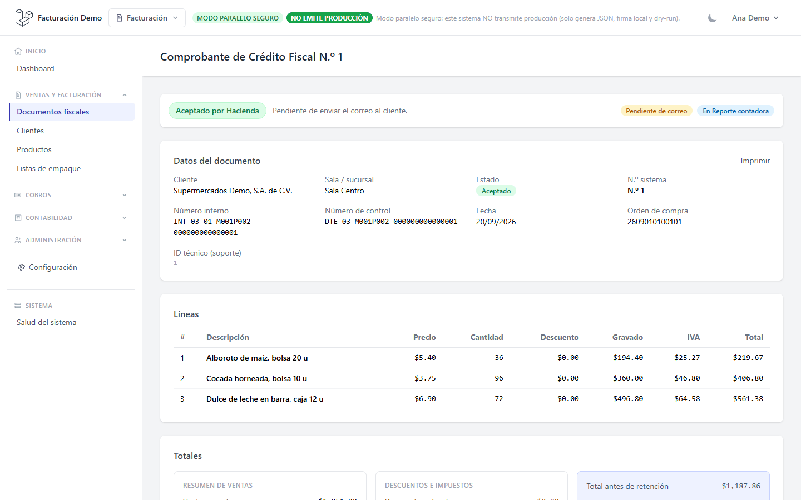
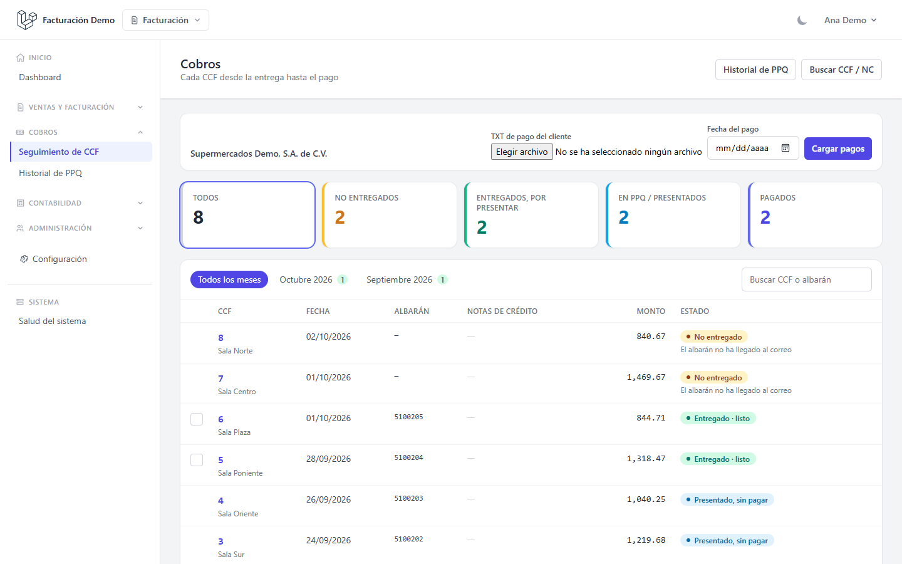
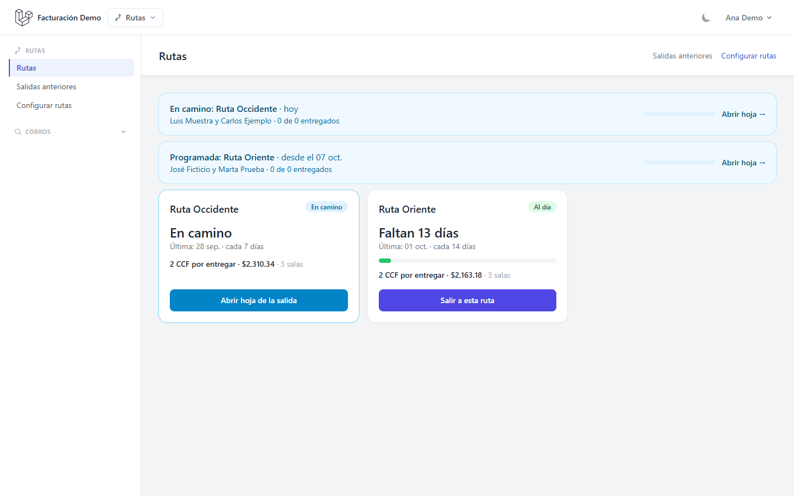
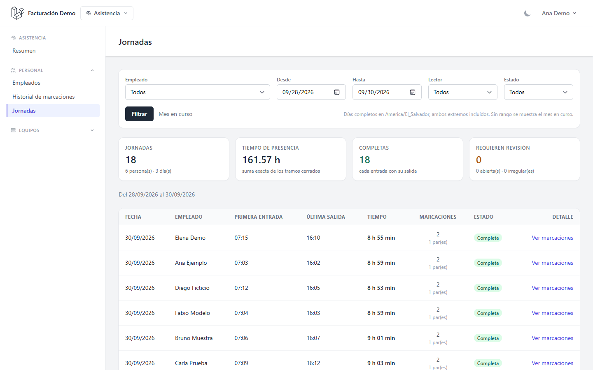
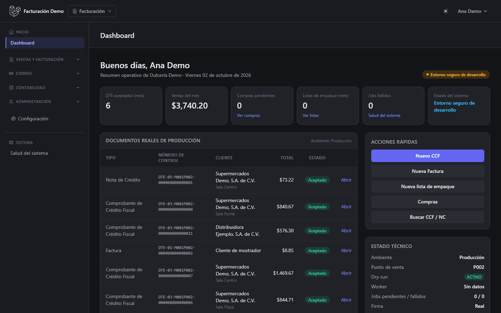
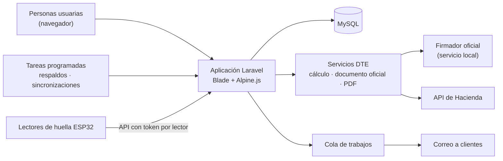

# Sistema de Facturación Electrónica (DTE)

[](https://github.com/Melquisspana/Sistema_Facturacion/actions/workflows/ci.yml)


[](LICENSE)

Sistema web de gestión hecho a la medida para una empresa de producción y distribución de El Salvador, y **en uso real** en su operación diaria. Su núcleo es la **facturación electrónica ante el Ministerio de Hacienda**; alrededor de ella reúne el seguimiento de cobros, las rutas de reparto, el inventario de planta, el control de asistencia con lectores de huella y los respaldos.



> Todas las capturas se tomaron sobre una base de datos desechable con **datos inventados** (empresa, clientes, productos y personas de ejemplo). El repositorio no contiene datos reales.

## Contenido

- [Qué hace](#qué-hace)
- [Capturas](#capturas)
- [Tecnología](#tecnología)
- [Arquitectura](#arquitectura)
- [Calidad](#calidad)
- [Seguridad](#seguridad)
- [Ejecutarlo en local](#ejecutarlo-en-local)
- [Licencia](#licencia)

## Qué hace

### Facturación electrónica con Hacienda

En El Salvador las facturas se emiten como **Documentos Tributarios Electrónicos (DTE)**: cada documento se arma en un formato oficial, se firma digitalmente y se envía a Hacienda, que lo revisa y devuelve un **sello de recepción** que lo hace válido. El sistema se encarga de todo ese recorrido:

- **Documentos que emite:** Factura de consumidor final, Comprobante de Crédito Fiscal (CCF), Nota de Crédito (NC) y Factura de Exportación (FEX).
- **Paso a paso:** borrador → revisión previa → número correlativo → documento oficial validado contra los esquemas de Hacienda → firma con el firmador oficial → envío → sello de Hacienda.
- **Invalidación:** anula ante Hacienda un documento ya aceptado, con sus reglas y el documento de reemplazo cuando corresponde.
- **Entrega al cliente:** representación en PDF con código QR para verificar el documento, y envío por correo con el PDF y el archivo oficial.
- **Cuidados que no dependen de la memoria de nadie:** un documento emitido no se edita (se corrige con una nota de crédito o se invalida); el número correlativo se asigna con bloqueo para que nunca se repita; si el envío falla, antes de reenviar se consulta a Hacienda para no duplicar.
- **Exportaciones:** listas de empaque que se convierten en Factura de Exportación.

### Cobros y prontos pagos

Los clientes grandes, como las cadenas de supermercados, pagan semanas después de recibir la mercadería y descuentan las notas de crédito. El módulo de **Cobros** sigue cada CCF desde que se entrega hasta que se paga:

- une cada factura con su comprobante de entrega (albarán);
- registra cuándo se presentó al cliente para su cobro;
- aplica el archivo de pagos que envía el cliente y marca cada factura como pagada, pendiente o con diferencia;
- arma los lotes de **prontos pagos (PPQ)** y los archivos que el cliente pide para procesarlos.

### Rutas de reparto

Organiza las rutas: qué salas (sucursales de los clientes) atiende cada una, cada cuántos días se sale, quién va en cada salida y qué se entregó.

### Producción (planta)

Inventario de planta: insumos, proveedores, ubicaciones, recepciones que crean lotes, traslados, ajustes y consultas de existencias y movimientos. Es un módulo **opcional**, que se enciende por configuración.

### Control de asistencia

Marcación de entrada y salida con **lectores de huella basados en ESP32** (el firmware está en [`firmware/`](firmware/)). El lector solo identifica a la persona; **la hora oficial la pone el servidor**, así que no importa si el reloj del lector se desajusta. Incluye personas, lectores, historial de marcaciones y reporte de jornadas. También es **opcional**.

### Compras y contabilidad

Recoge del correo de compras los DTE que envían los proveedores, prepara el reporte de ventas para contabilidad y genera un paquete mensual (ZIP) con compras y ventas para la persona contadora.

### Administración

Usuarios con cinco roles y permisos por acción, bitácora de cambios, panel de salud del sistema (base de datos, cola de trabajos, respaldo del día, migraciones pendientes y coherencia de la configuración fiscal) y **respaldos diarios verificados** de la base de datos y los archivos.

### Estado de cada área

| Área | Estado |
| --- | --- |
| Facturación electrónica, exportaciones, cobros y PPQ | Disponible |
| Rutas de reparto | Disponible |
| Compras, contabilidad y administración | Disponible |
| Producción (planta) | Opcional: se enciende por configuración |
| Control de asistencia | Opcional: se enciende por configuración |
| Gastos y Planilla | En construcción: **apagados**, no se usan todavía |

## Capturas

| | |
| --- | --- |
|  **Documentos fiscales:** todos los DTE con su estado ante Hacienda. |  **Detalle de un CCF:** datos, líneas y totales del documento. |
|  **Cobros:** cada CCF desde la entrega hasta el pago. |  **Rutas:** salidas en camino y próximas. |
|  **Asistencia:** jornadas calculadas a partir de las marcaciones. |  **Modo oscuro:** toda la interfaz tiene tema claro y oscuro. |

## Tecnología

| Capa | Herramientas |
| --- | --- |
| Aplicación | PHP 8.3, Laravel 12 |
| Interfaz | Blade, Alpine.js, Tailwind CSS, Vite |
| Base de datos | MySQL 8 (las pruebas corren sobre SQLite en memoria y, en la CI, también sobre MySQL estricto) |
| Documentos | DomPDF (PDF), endroid/qr-code (QR), PhpSpreadsheet (Excel), opis/json-schema (validación contra los esquemas oficiales) |
| Seguridad y operación | spatie/laravel-permission (roles), spatie/laravel-activitylog (bitácora), spatie/laravel-backup (respaldos) |
| Integraciones | API de Hacienda, firmador oficial del Ministerio de Hacienda (servicio local), correo (SMTP e IMAP), API de Gmail |
| Hardware | Lectores de huella con ESP32 que hablan con una API propia |

## Arquitectura

Es un **monolito Laravel** ordenado por áreas de negocio. Los controladores solo reciben la petición; las reglas viven en servicios, y los estados de un DTE pasan por una máquina de estados explícita que registra cada cambio.



Organización del código:

| Carpeta | Contenido |
| --- | --- |
| [`app/Services/Dte`](app/Services/Dte) | Emisión: borrador, cálculo, documento oficial, validación, firma, transmisión, invalidación, PDF y correo |
| [`app/Services`](app/Services) | Un subdirectorio por área: Cobros, Ppq, Rutas, Planta, Asistencia, DocumentosRecibidos, Contabilidad, Sistema… |
| [`app/Enums`](app/Enums) | Estados, tipos de documento, roles y permisos como enumeraciones |
| [`routes`](routes) | Un archivo de rutas por área, con los permisos que exige cada una |
| [`tests`](tests) | Pruebas de funcionalidad y unitarias |
| [`firmware/asistencia`](firmware/asistencia) | Programa del lector de huella (ESP32) |

Para profundizar:

- [Flujo de emisión de un DTE](docs/diagramas/emision-dte.visual-check.1440x900.light.png): del borrador a la respuesta de Hacienda (diagrama).
- [Transmisión a Hacienda](docs/TRANSMISION_DTE.md), [invalidación](docs/INVALIDACION_DTE.md) y [firmador local](docs/FIRMADOR_LOCAL.md).
- [Control de asistencia](docs/CONTROL_ASISTENCIA.md) y [diseño del módulo de rutas](docs/DISENO_MODULO_RUTAS_20260926.md).
- [Documento de arquitectura inicial](ARQUITECTURA.md), con el plan con el que arrancó el proyecto.

## Calidad

- **Integración continua** en GitHub Actions en cada cambio: la suite de PHPUnit (más de 6.000 pruebas), una segunda corrida sobre MySQL en modo estricto (informativa por ahora) y el estilo de código con Laravel Pint.
- **Pruebas aisladas:** la suite se niega a correr contra una base que no sea SQLite en memoria, salvo la base desechable de la CI. Nunca toca datos reales.
- **Flujo con ramas y pull requests:** nada entra directo a la rama principal; cada cambio pasa por revisión y por la CI.
- **Decisiones registradas:** las decisiones de arquitectura y de proceso quedan en [`docs/decisiones`](docs/decisiones).
- **Registro de cambios:** cada versión queda anotada en [`CHANGELOG.md`](CHANGELOG.md).

## Seguridad

- Roles y permisos comprobados en el servidor en cada ruta; los botones de la interfaz nunca autorizan por sí solos.
- Bloqueo temporal del inicio de sesión tras varios intentos fallidos y cabeceras de seguridad con política de contenido (CSP).
- Bitácora de quién cambió qué.
- El envío real a Hacienda viene **apagado por defecto** y exige confirmaciones explícitas en la configuración.

Las vulnerabilidades se reportan de forma privada, como indica [SECURITY.md](SECURITY.md). No abras un issue público.

## Ejecutarlo en local

Requisitos: PHP 8.3 con las extensiones habituales de Laravel, Composer, Node.js 22 y MySQL 8 (o SQLite para probar).

```bash
composer install
cp .env.example .env
php artisan key:generate
php artisan migrate
php artisan db:seed --class=CatalogosMhSeeder
php artisan db:seed --class=UsuarioAdminInicialSeeder
npm install
npm run build
php artisan serve
```

El último seeder crea el usuario administrador y muestra **una sola vez** su contraseña aleatoria. Con la configuración de ejemplo el sistema no firma ni transmite nada a Hacienda: para eso hacen falta el firmador oficial, un certificado y las credenciales de la empresa emisora.

Para correr las pruebas:

```bash
vendor/bin/phpunit
```

## Licencia

Todos los derechos reservados: el código es público como portafolio, no de uso libre. Ver [LICENSE](LICENSE). Laravel y las demás dependencias conservan sus propias licencias.
